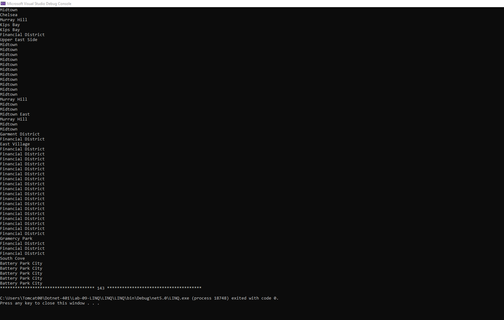

# Lab-09-LINQ
## Ahmad Masadeh 

# Tell them what it is (with context, provide a summary)
This app read json Contains locations and give you the neighborhood for each location and filter the locations that dont have a neighborhood and filter the neighborhood without duplicates 
#  Show them what it looks like in action (Visuals)

    public class data
    {
        public string type { get; set; }
        public List<features> features { get; set; }
    }
    public class features
    {
        public string type { get; set; }
        public geometry geometry { get; set; }
        public properties properties { get; set; }
    } 
    public class geometry
    {
        public string type { get; set; }
        public decimal[] coordinates { get; set; }
    }
    public class properties
    {
        public string zip { get; set; }
        public string city { get; set; }
        public string state { get; set; }
        public string address { get; set; }
        public string borough { get; set; }
        public string neighborhood { get; set; }
        public string county { get; set; }
    }
     public class Program
    {

        static void Main(string[] args)
        {

            using (StreamReader r = new("../../../../data.json")) 
            {
                string json = r.ReadToEnd();
                data data = JsonConvert.DeserializeObject<data>(json);
                int count = 0;
                IEnumerable<string> neighborhood = data.features.Select(feature => feature.properties.neighborhood);
                foreach (string neighbor in neighborhood)
                {
                    Console.WriteLine(neighbor);
                    count++;
                }
                Console.WriteLine("************************************** " + count + " **************************************");
                count =0;
                IEnumerable<string> emptyNeighborhood = from feature in data.features where feature.properties.neighborhood!="" select feature.properties.neighborhood;
                foreach (string neighbor in emptyNeighborhood)
                {
                    Console.WriteLine(neighbor);
                    count++;
                }
                Console.WriteLine("************************************** " +count + " **************************************");
                count = 0;
                IEnumerable<string> noDuplicatesNeighborhood = data.features.Select(feature => feature.properties.neighborhood).Where(feature => feature!= "").Distinct();
                foreach (string neighbor in noDuplicatesNeighborhood)
                {
                    Console.WriteLine(neighbor);
                    count++;
                }
                Console.WriteLine("************************************** " + count + " **************************************");
                count = 0;
                IEnumerable<string> emptyNeighborhoodOpposingMethod= data.features.Select(feature => feature.properties.neighborhood).Where(feature => feature != "");
                foreach (string neighbor in emptyNeighborhoodOpposingMethod)
                {
                    Console.WriteLine(neighbor);
                    count++;
                }
                Console.WriteLine("************************************** " + count + " **************************************");

            }
            
        }
    }
# (Visuals)

# Show them how they use it (Step by step directions, “Happy Path” walkthrough)

1. Open LINQ.sln 
2. Go to Program.cs
3. press RUN
4. Now you can see the output on the Console

